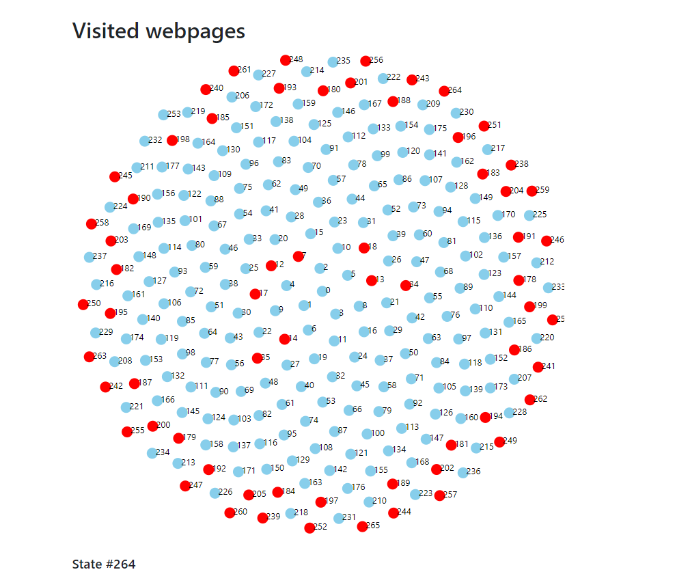

# Ripper Testing for Ghost CMS App

## Project Information

- University: Universidad de los Andes
- Project: RIPuppet of the Ghost CMS application

## Members

- David Sánchez
- Juan Chiroque
- Diego Correa
- Julio Cardenas

This project aims to test the Ghost CMS application by simulating random user actions and analyzing the application's behavior under such conditions. Using Playwright and Ripper testing, we can automate this process and detect potential issues that may arise when using the application. The Playwright tool provides a reliable and fast automation solution for running end-to-end tests, while Ripper testing allows for the creation of randomized and exploratory tests. By combining these tools, we can thoroughly test the Ghost CMS application and ensure its functionality and stability.

## Demo


## Results



Found 62 errors in 265 states

## Prerequisites

- Node.js v14.17.3
- Google Chrome browser

## Installation

To set up the project on your local machine, follow these steps:

1. Clone the repository:

```bash
git clone https://github.com/dcsm8/uniandes-rippers.git
```

2. Navigate to the project directory:

```bash
cd uniandes-rippers
```

3. Install the required dependencies:

```bash
npm install
```

4. Update the config.json

```json
{
  "url": "http://localhost:3001/ghost",
  "headless": false,
  "depthLevels": 2,
  "inputValues": true,
  "values": {
    "ember8": "<<your-email-here>>",
    "ember10": "<<your-password-here>>"
  },
  "browsers": ["chromium"]
}
```

5. Start the ripper:

```bash
node index.js
```

## Results

1. Install http-server:

```bash
npm install -g http-server
```

2. make sure you're in the uniandes-rippers folder

```bash
http-server
```

3. Open the results folder, open chromium and then select report.html
